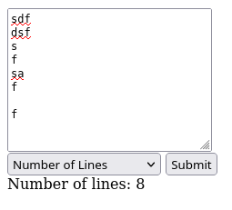

# Initial Go Webserver Creation

## Overview

I have never written a line of Go before.

I was able to stand up this very basic web server in about ten minutes with simple
prompts/copy/paste iterations with ChatGPT 4.

Prompts:

> Generate a go web service that provides a webpage that accepts an multi-line input text field and submit button. When I click submit, have a rest endpoint of the go service compute the number of lines in the input and print the result below the submit button.

> Please explain how to wrap that main.go in a docker container, as I do not have go installed.

> How do I generate go.mod for the project considering the above main.go?

> Please add the "go mod init" action to the dockerfile

> Update the main.go so that it dynamically updates the page with the result, appending the result below the inputs

> Update main.go with a drop-down that allows selection between multiple computations. One option is "Number of Lines" (the current behavior), but another option is "Number of Characters"

> Break out the "number of lines" and "number of characters" into separate go files

Result:

