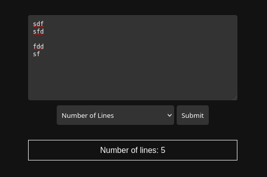

# Updated CSS Styling

I wanted a little more modern look, so I asked ChatGPT 4 to update my styling...

* Prompt:

        Given the following main.go, add CCS styling that:

        * Centers all inputs on the page
        * Uses a dark, aesthetically pleasing theme
        * Uses modern looking fonts

        === Begin main.go ===

        (pasted contents of main.go)

* Prompt:

        Please style the text box and buttons to be darker colored and resize the text box to be 75% of the width of the browser.

* Prompt:

        Why are the results no longer being rendered in the result div?

... where the last prompt pointed me to a bad copy/paste job on my part.

Now I have this:

